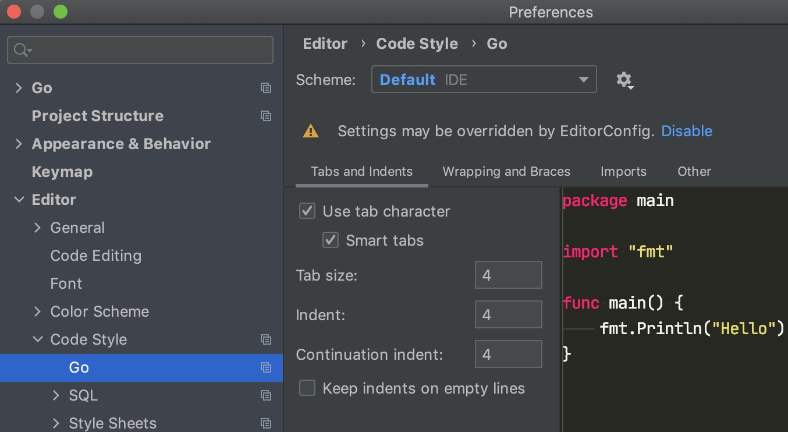
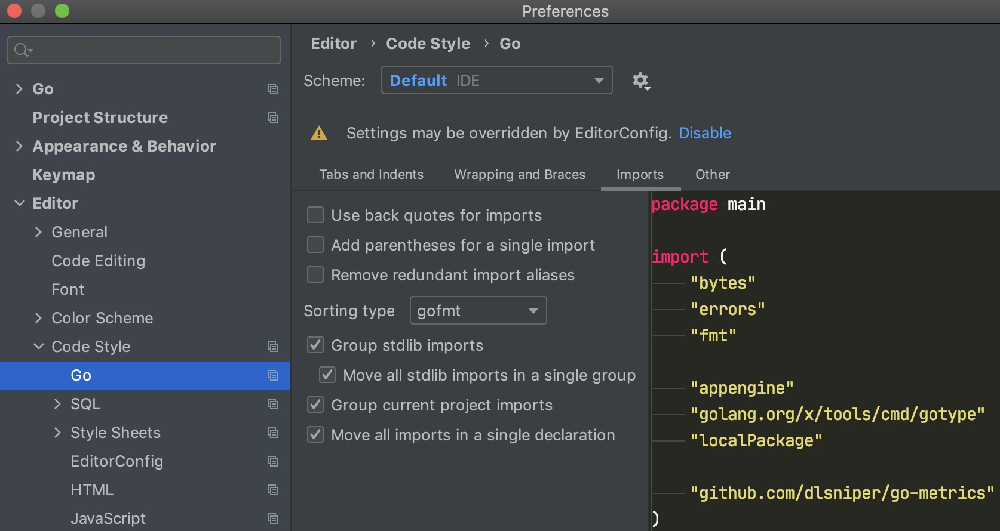
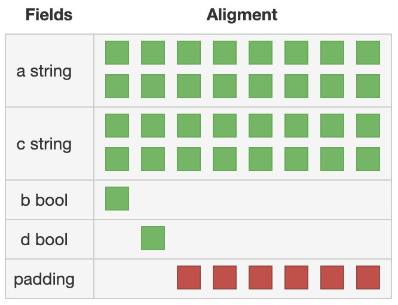
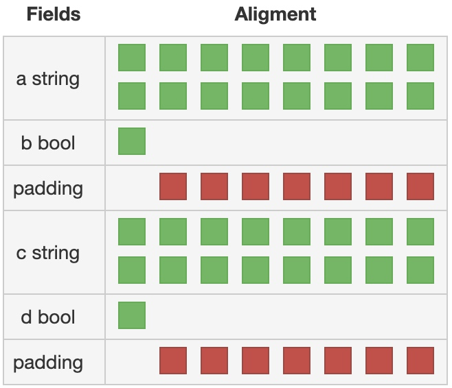

# Go 语言规范 - 编码风格篇
> 当前版本: v1.0.20201106
> GitHub: [shockerli/go-code-guide](https://github.com/shockerli/go-code-guide)

## 命名规则
- 站在调用者的角度，包不是给你自己用的
- 简洁、且见名知义
- 采用通用、大众熟知的缩写命名。比如`buf`而不是`bufio`
- 如果缩写的名字会产生歧义，则放弃或换个

### 文件名
整个应用或包的主入口文件应当是 `main.go`，或与应用名称简写相同。

比如：`spiker` 包的主入口文件是 `spiker.go`，应用的主入口文件是 `main.go`


### 包名
- 包名与目录名一致

    如果一个目录下同时出现多个 `package`，则编译失败：

    ```
    found packages pkg (a.go) and pb (b.go) in XXX
    ```

- 大多数使用命名导入的情况下，不需要重命名

    少让调用者去起别名，除非名字太烂

- 全部小写，没有下划线、大写。错误示例`MyPackage`、`my_package`、`myPackage`

- 不用复数。例如`net/url`，而不是`net/urls`

- 不用信息量不足的名字。错误示例`common`、`lib`、`util`


### 导入包
- 如果程序包名称与导入路径的最后一个元素不匹配，则必须使用导入别名

```go
import (
    client "example.com/client-go"
    trace "example.com/trace/v2"
)
```

- 在所有其他情况下，除非导入之间有直接冲突，否则应避免导入别名

```go
import (
    "net/http/pprof"
    gpprof "github.com/google/pprof"
)
```

- 如遇重名，请保留标准包而别名自定义或第三方包

- 在非测试文件（`*_test.go`）中，禁止使用 `.` 来简化导入包的对象调用

- 禁止使用相对路径导入（`./subpackage`），所有导入路径必须符合 `go get` 标准

### 驼峰命名法
常量、变量、类型、结构体、接口、函数、方法、属性等，全部使用驼峰法 MixedCaps 或 mixedCaps。

下划线开头的命名更不允许，Go 语言的公私有统一用大小写开头来区分。

但有个例外，为了对相关的测试用例进行分组，函数名可能包含下划线，如：TestMyFunction_WhatIsBeingTested。

**Bad**:

```go
const ROLE_NAME = 10
```

**Good**:

```go
const RoleName = 10
```


### 常量
- 如果是枚举类型的常量，需要先创建相应类型

```go
type Scheme string

const (
    Http  Scheme = "http"
    Https Scheme = "https"
)
```

- 如果模块的功能较为复杂、常量名称容易混淆的情况下，为了更好地区分枚举类型，可以使用完整的前缀

```go
type Symbol string

const (
    SymbolAdd Symbol = "+"
    SymbolSub Symbol = "-"
)
```

### 变量
- 在相对简单的环境（对象数量少、针对性强）中，可以将一些名称由完整单词简写为单个字母

    + `user` 可以简写为 `u`
    + `userId` 可以简写 `uid`

- 若变量类型为 `bool` 类型，则名称应以 `Has`、`Is`、`Can` 或 `Allow` 开头

```go
var isExist bool
var hasConflict bool
var canManage bool
var allowGitHook bool
```

### URL
- URL 命名全部小写
- 用正斜杠 `/` 表明层级关系
- 使用连字符 `-` 来提高长路径中名称的可读性
- 不得在 URL 中使用下划线 `_`
- URL 结尾不应包含正斜杠 `/`
- 文件扩展名不应包含在 URL 中
- URL 需见名知意，但不可暴露服务器架构

**Bad**:

```
/GetUserInfo
/photos_path
/My-Folder/my-doc/
/user/user-list
```

**Good**:

```
/user/list
/user/operator-logs
```


### 函数/方法名
- 不要画蛇添足

- 长命名并不会使其更具可读性，一份有用的说明文档通常比额外的长名更有价值

**Bad**:

```go
once.DoOrWaitUntilDone(f)
```

**Good**:

```go
once.Do(f)
```

- 在 pkg 包中名为 New 的函数会返回一个 pkg.Pkg 类型的值

```go
q := list.New()  // q is a *list.List
```

- 当 pkg 包中某个函数的返回值类型为 pkg.Pkg （或 *pkg.Pkg ）时，函数名应省略类型名

```go
start := time.Now()                                  // start is a time.Time
t, err := time.Parse(time.Kitchen, "6:06PM")         // t is a time.Time
```

- 当函数返回的值类型为 pkg.T 且 T 不为 Pkg 时，函数名应包含 T 以便让用户代码更易理解

```go
ticker := time.NewTicker(d)          // ticker is a *time.Ticker
timer := time.NewTimer(d)            // timer is a *time.Timer
```

- 获取器/设置器

    Go 并不对获取器（getter）和设置器（setter）提供自动支持。针对某个变量或字段，获取器名字无需携带 `Get`，设置器名字以 `Set` 开头。

    若你有个名为 owner （小写，未导出）的字段，其获取器应当名为 Owner（大写，可导出）而非 GetOwner。

**Bad**:

```go
owner := obj.GetOwner()
if owner != user {
    obj.SettingOwner(user)
}
```

**Good**:

```go
owner := obj.Owner()
if owner != user {
    obj.SetOwner(user)
}
```

- 若函数或方法为判断类型（返回值主要为 bool 类型），则名称应以 `Has`、`Is`、`Can` 或 `Allow` 等判断性动词开头

```go
func HasPrefix(name string, prefixes []string) bool { ... }
func IsEntry(name string, entries []string) bool { ... }
func CanManage(name string) bool { ... }
func AllowGitHook() bool { ... }
```


### 接口名
按照约定，只包含一个方法的接口应当以该方法的名称加上 -er 后缀来命名，如 Reader、Writer、Formatter/CloseNotifier 等。

名词用于接口名，动词用于接口的方法名。

```go
type Reader interface {
    Read(p []byte) (n int, err error)
}
```


### Error
- `Error` 类型的命名以 `Error` 结尾

```go
type ParseError struct {
    Line, Col int
}
```

- `Error` 类型的变量，以 `Err`开头

```go
var ErrBadAction = errors.New("somepkg: a bad action was performed")
```

- 返回类型为 `Error` 的变量缩写采用 `err`

```go
func foo() {
    res, err := somepkgAction()
    if err != nil {
        if err == somepkg.ErrBadAction {
        }
        if pe, ok := err.(*somepkg.ParseError); ok {
             line, col := pe.Line, pe.Col
             // ....
        }
    }
}
```


### 其他

#### 包内容的名字不可以包名开头，因为无需重复包名
`http` 包提供的 HTTP 服务名为 `http.Server` ，而非 `HTTPServer` 。用户代码通过 `http.Server` 引用该类型，因此没有歧义。

#### 不同包中的类型名可以相同，因为客户端可通过包名区分它们
例如，标准库中含有多个名为 Reader 的类型，包括 `jpeg.Reader` 、 `bufio.Reader` 和 `csv.Reader`。每个包名搭配 Reader 都是个不错的类型名。


## 名词缩写表
| 缩写名 | 说明 |
| :---: | --- |
| `ctx` | `Context` 或相关，比如 `gin.Context` |


## 分号
Go 其实也是用分号（`;`）来结束语句，但 Go 与 JavaScript 一样不建议给单一语句末尾加分号，因为编译器会自动加分号。

像如下语句是完全可以的：

```go
go func() { for { dst <- <-src } }()
```

通常 Go 程序只在诸如 for 循环子句这样的地方使用分号，以此来将初始化器、条件及增量元素分开。如果你在一行中写多个语句，也需要用分号隔开。

```go
if err := f(); err != nil {
    g()
}
```

也是因为这个原因，函数或控制语句的左大括号绝不能放在下一行。

```go
if i < f()  // 报错
{           // 报错
    g()
}
```


## 圆括号
控制结构（if、for 和 switch）不需要圆括号，语法上就不需要

## 文档
`README`、项目文档、接口文档等，**中文**文档的排版参考：[中文文案排版指北](https://github.com/sparanoid/chinese-copywriting-guidelines)


## 注释
- 所有导出对象必须注释说明其用途，非导出对象根据情况进行注释
- 如果对象可数且无明确指定数量的情况下，一律使用单数形式和一般进行时描述，否则使用复数形式
- 包、函数、方法和类型的注释说明都是一个完整的句子
- 句子类型的注释首字母均需大写，短语类型的注释首字母需小写
- 注释的单行长度不能超过 80 个字符，超过请强制换行

- 可导出对象的注释，必须以对象的名称作为开头

```go
// FileInfo is the interface that describes a file and is returned by Stat and Lstat
type FileInfo interface { ...

// HasPrefix returns true if name has any string in given slice as prefix
func HasPrefix(name string, prefixes []string) bool { ...
```

### 单行注释&多行注释
- 两种注释风格，单行注释 `//`，多行注释 `/* ... */`

- 多行注释仅用于包级别的文档注释，除此之外请用单行注释。包注释一般放置到 `doc.go` 文件，且该文件仅包含文档注释内容

- 单行注释符号与内容之间，请用**一个空格**隔开

**Bad**:

```go
//Comments
```

**Good**:

```go
// Comments
```

**GoLand 可设置自动格式化：**

`Preferences > Editor > Code Style > Go > Other` 勾选上 `Add leading space to comments`


### 包注释

- 包级别的注释就是对包的介绍，只需在同个包的任一源文件中说明即可有效

- 对于 `main` 包，一般只有一行简短的注释用以说明包的用途，且以项目名称开头

```go
// Write project description
package main
```

- 对于一个复杂项目的子包，一般情况下不需要包级别注释，除非是代表某个特定功能的模块

- 对于简单的非 `main` 包，也可用一行注释概括

- 对于相对功能复杂的非 `main` 包，一般都会增加一些使用示例或基本说明，且以 `Package <name>` 开头

```go
/*
Package http provides HTTP client and server implementations.
...
*/
package http
```

- 特别复杂的包说明，可单独创建 `doc.go` 文件来加以说明


### 函数与方法
- 如果一句话不足以说明全部问题，则可换行继续进行更加细致的描述

```go
// Copy copies file from source to target path.
// It returns false and error when error occurs in underlying function calls.
```

- 若函数或方法为判断类型（返回值主要为 `bool` 类型），则以 `<name> returns true if` 开头

```go
// HasPrefix returns true if name has any string in given slice as prefix.
func HasPrefix(name string, prefixes []string) bool { ...
```

### 结构、接口及其它类型
- 类型的定义一般都以单数形式描述：

```go
// Request represents a request to run a command.
type Request struct { ...
```

- 如果为接口，则一般以以下形式描述：

```go
// FileInfo is the interface that describes a file and is returned by Stat and Lstat.
type FileInfo interface { ...
```

- 如果结构体属性较多，需对属性添加注释

```go
// Var variable for expression
type Var struct {
    Key   string      `json:"key"`   // variable key
    Value interface{} `json:"value"` // value
    Desc  string      `json:"desc"`  // variable description
}
```

### 其他说明
- 当某个部分等待完成时，可用 `TODO:` 开头的注释来提醒维护人员。

- 当某个部分存在已知问题进行需要修复或改进时，可用 `FIXME:` 开头的注释来提醒维护人员。

- 当需要特别说明某个问题时，可用 `NOTE:` 开头的注释：

```go
// NOTE: os.Chmod and os.Chtimes don't recognize symbolic link,
// which will lead "no such file or directory" error.
return os.Symlink(target, dest)
```


## 格式化
我们没有太多可选的余地，因为 Go 已经规范好了，在 Go 世界没有此类战争。

### 缩进
缩进统一采用**4个空格**，禁用制表符。

EditorConfig 设置：

```
[{Makefile,go.mod,go.sum,*.go}]
indent_style = tab
indent_size = 4
```

或 **GoLand** 设置：

`Preferences > Editor > Code Style > Go > Tabs and Indents`




### 空行
- 适当增加空行以保持代码段落清晰


## 其他

### 函数分组与顺序
> - 函数应按粗略的调用顺序排序
> - 同一文件中的函数应按接收者分组

- 导出的函数应先出现在文件中，放在 `struct`、`const` 和 `var` 定义的后面。
- 在定义类型之后，但在接收者的其余方法之前，可能会出现一个 `newXYZ()` / `NewXYZ()`。
- 由于函数是按接收者分组的，因此普通工具函数应在文件末尾出现。
- 因此，一般一个 `struct` 及相关方法组织为一个文件。

**Bad**:

```go
func (s *something) Cost() {
    return calcCost(s.weights)
}

type something struct{ ... }

func calcCost(n int[]) int {...}

func (s *something) Stop() {...}

func newSomething() *something {
    return &something{}
}
```

**Good**:

```go
type something struct{ ... }

func newSomething() *something {
    return &something{}
}

func (s *something) Cost() {
    return calcCost(s.weights)
}

func (s *something) Stop() {...}

func calcCost(n int[]) int {...}
```


### 减少嵌套

**Bad**:

```go
for _, v := range data {
    if v.F1 == 1 {
        v = process(v)
        if err := v.Call(); err == nil {
            v.Send()
        } else {
            return err
        }
    } else {
        log.Printf("Invalid v: %v", v)
    }
}
```

**Good**:

```go
for _, v := range data {
    if v.F1 != 1 {
        log.Printf("Invalid v: %v", v)
        continue
    }

    v = process(v)
    if err := v.Call(); err != nil {
        return err
    }
    v.Send()
}
```

### 不必要的 else
- 多数时候，我们可以把 else 分支里的代码提取为初始化。

**Bad**:

```go
var a int
if b {
    a = 100
} else {
    a = 10
}
```

**Good**:

```go
a := 10
if b {
    a = 100
}
```


### 全局变量声明
- 全局变量，必须使用 `var` 关键字
- 请勿指定类型，除非它与表达式的类型不同

**Bad**:

```go
var a string = "abc"
var s string = F()
    
func F() string { return "A" }
```

**Good**:

```go
var a = "abc"
// 由于 F() 已经明确了返回一个字符串类型，因此我们没有必要显式指定 s 的类型
var s = F()
    
func F() string { return "A" }
```

- 如果表达式的类型与所需的类型不完全匹配，请指定类型

```go
type myError struct{}

func (myError) Error() string { return "error" }

func F() myError { return myError{} }

var err error = F()
// F() 返回一个 myError 类型的实例，但是我们要 error 类型
```


### 局部变量声明
- 如果将变量明确设置为某个值，则应使用短变量声明形式（`:=`）

**Bad**:

```go
var s string = "abc"
```
    
**Good**:

```go
s := "abc"
```

- 如果变量专用于引用，则使用 `var` 关键字更合适

```go
func s() {
    var s string
    f(&s)
}
```

- 如果变量是返回值，则定义在函数返回类型中

```go
func f(list []int) (filtered []int) {
    for _, v := range list {
        if v > 10 {
            filtered = append(filtered, v)
        }
    }
    return
}
```


### import 包导入分组与排序
- 同一文件，如果导入多个包，对其进行分组
- **标准包**、**第三方包**、**自定义包**，分别分组、空行分隔、排序

**Bad**:

```go
import "a"
import "golang.org/x/sys"
import "runtime"
import "github.com/gin-gonic/gin"
import "b"
import "fmt"
```

**Good**:

```go
import (
    "fmt"
    "runtime"

    "a"
    "b"

    "github.com/gin-gonic/gin"
    "golang.org/x/sys"
)
```

**GoLand** 设置如下：




### 相似的声明进行分组
对于 `var`、`const`、`type` 等声明语句：

- 将相似的声明放在一个组内

**Bad**:

```go
const a = 1
const b = 2

var a = 1
var b = 2

type Area float64
type Volume float64
```

**Good**:

```go
const (
    a = 1
    b = 2
)

var (
    a = 1
    b = 2
)

type (
    Area float64
    Volume float64
)
```

- 仅将相关的声明放在一组，不要将不相关的声明放在一组

**Bad**:

```go
type Operation int

const (
    Add Operation = iota + 1
    Subtract
    Multiply
    RoleName = "Role Name"
)
```

**Good**:

```go
type Operation int

const (
    Add Operation = iota + 1
    Subtract
    Multiply
)

const RoleName = "Role Name"
```

- 分组使用的位置没有限制，函数内也可使用分组

**Bad**:

```go
func f() string {
    var red = color.New(0xff0000)
    var green = color.New(0x00ff00)
    var blue = color.New(0x0000ff)

    // ...
}
```

**Good**:

```go
func f() string {
    var (
        red   = color.New(0xff0000)
        green = color.New(0x00ff00)
        blue  = color.New(0x0000ff)
    )

    // ...
}
```

### 函数/方法的参数/返回类型顺序
- 简单类型优先于复杂类型

**Bad**:

```go
func F(u User, n int) {}
```

**Good**:

```go
func F(n int, u User) {}
```

- 尽可能将同种类型的参数放在相邻位置，则只需写一次类型

**Bad**:

```go
func F(a int, c string, b int) {}
```

**Good**:

```go
func F(a, b int, c string) {}
```

- `error` 永远在最后一个返回类型

**Bad**:

```go
func F() (error, int) {}
```

**Good**:

```go
func F() (int, error) {}
```


### 结构体属性顺序
我们先看下示例：

结构体A - 定义：

```go
struct {
    a string
    c string
    b bool
    d bool
}
```

结构体A - 大小为40，内存布局图：



对比，结构体B - 定义：

```go
struct {
    a string
    b bool
    c string
    d bool
}
```

结构体B - 大小为48，内存布局图：



我们发现，**结构体的属性顺序不同，占用的内存大小和布局是完全不同的**。

那我们因此**约定：将相同类型的属性尽量放置在一起**。即，推荐结构体A中的定义顺序。


### 结构体中的嵌入
> 嵌入式类型（例如mutex）应位于结构体内的字段列表的顶部，并且必须有一个空行将嵌入式字段与常规字段分隔开。

**Bad**:

```go
type Client struct {
    version int
    http.Client
}
```

**Good**:

```go
type Client struct {
    http.Client

    version int
}
```


### 初始化结构体时必须指定字段名
> **必须**在初始化结构体时指定字段名，否则相关工具和 Review 都不给过。如果不指定，会对代码重构造成不可预期的后果。

**Bad**:

```go
k := User{"John", "Doe", true}
```

**Good**:

```go
k := User{
    FirstName: "John",
    LastName: "Doe",
    Admin: true,
}
```

> **唯一例外**：如果有3个或更少的字段，则可以在测试表中省略字段名

```go
tests := []struct{
}{
    op Operation
    want string
}{
    {Add, "add"},
    {Subtract, "subtract"},
}
```

### 缩小变量作用域
- 如果有可能，尽量缩小变量作用范围，除非它与减少嵌套的规则冲突

**Bad**:

```go
err := ioutil.WriteFile(name, data, 0644)
if err != nil {
    return err
}
```

**Good**:

```go
if err := ioutil.WriteFile(name, data, 0644); err != nil {
    return err
}
```

- 如果需要在 if 之外使用函数调用的结果，则不应尝试缩小范围

**Bad**:

```go
if data, err := ioutil.ReadFile(name); err == nil {
    err = cfg.Decode(data)
    if err != nil {
    return err
    }

    fmt.Println(cfg)
    return nil
} else {
    return err
}
```

**Good**:

```go
data, err := ioutil.ReadFile(name)
if err != nil {
    return err
}

if err := cfg.Decode(data); err != nil {
    return err
}

fmt.Println(cfg)
return nil
```


### Error 信息不应大写或标点符号结束
**Bad**:

```go
fmt.Errorf("Something bad.")
```

**Good**:

```go
fmt.Errorf("something bad")
```

Error 描述信息是需要被包裹或引用描述的，那么下面的代码将告诉我们为何不应如此：

```go
log.Printf("Reading %s: %v", filename, err)
```


### slice
> `nil` 是一个有效长度为 0 的 slice

- 零值切片可立即使用，无需调用make创建

**Bad**:

```go
nums := []int{}
// or, nums := make([]int, 0)

if add1 {
    nums = append(nums, 1)
}
```

**Good**:

```go
var nums []int

if add1 {
    nums = append(nums, 1)
}
```

- 要检查切片是否为空，请始终使用 `len(s) == 0`，不要检查 `nil`

**Bad**:

```go
func isEmpty(s []string) bool {
    return s == nil
}
```

**Good**:

```go
func isEmpty(s []string) bool {
    return len(s) == 0
}
```

- 对于需要序列化的切片，则必须使用make初始化

**Bad**:

```go
var v []int
s, _ := json.Marshal(v)
println(string(s))
// output: null
```

**Good**:

```go
v := make([]int, 0)
s, _ := json.Marshal(v)
println(string(s))
// output: []
```


## 参考资料
- [Package names - Go Blog](https://github.com/golang/blog/blob/master/content/package-names.article)
- [Style guideline for Go packages](https://rakyll.org/style-packages)
- [Organizing Go code - Go Blog](https://github.com/golang/blog/blob/master/content/organizing-go-code.article)
- [How to Write Go Code - Go Blog](https://golang.org/doc/code.html)
- [Effective Go](https://golang.org/doc/effective_go.html)
- [Go Code Convention](https://github.com/unknwon/go-code-convention)
- [Go Wiki - Errors](https://github.com/golang/go/wiki/Errors)
- [Uber Go Style Guide](https://github.com/uber-go/guide)

